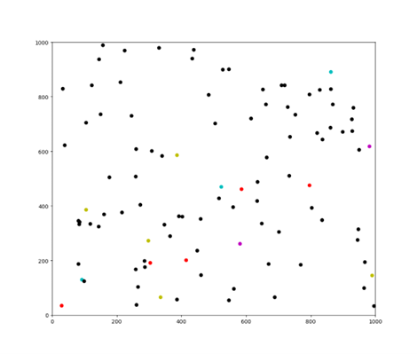
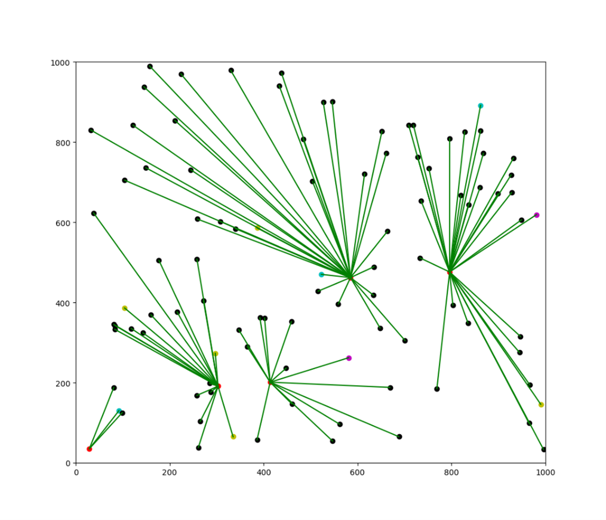

# MCEW-algorithm-design
## About MCEW
The mentioned concepts can be found in the theory of **Access network design**.

MCEW stands for Multi-Center Esau-Williams. MCEW algorithm solves the problem in multi-center local access network design. The algorithm builds a set of trees that connect each access node to a backbone node, and finally constructs a forest of trees – often not interconnected.  
## Implementation
### IDE
The project is implemented on [Spyder IDE](https://www.spyder-ide.org/).
### Framework
The project uses the [Matplotlib](https://matplotlib.org/stable/index.html#) framework for visualization.
### Project structure
* MCEW_algorithm folder: Spyder project
* Reports folder: a word report and a slide
* MCEW.drawio: the MCEW algorithm flowchart
* .image folder: the result images
### Results
Create points on the plane.  

  

Find access nodes connected to each backbone node.  

  

The access network is obtained after applying the MCEW algorithm.  

  

